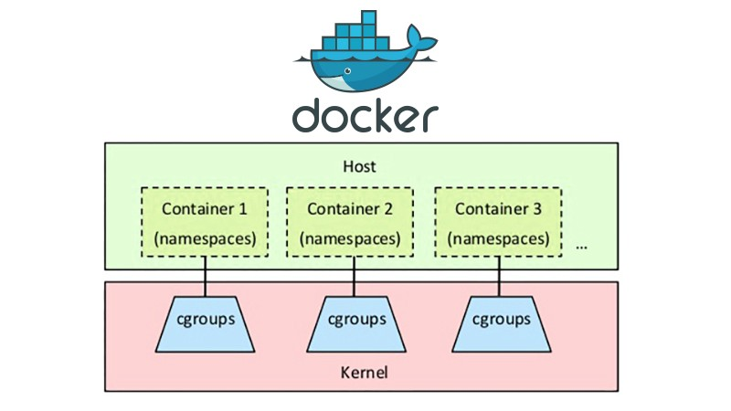

# Lab 7: Container

本次实验将实现简单的 container

使用如下命令获取本次实验代码：

```shell
git fetch --all
git checkout lab7
git merge lab6 # or your current branch name
```

## 7.1 Multitasking

并非所有进程都以 `exit` 结束，有些代码会特意执行循环。

```c
int
main(int argc, char **argv) {
    while(1) {
        check_for_input();
        do_something_about_it();
        yield();
    }
    exit();
}
```

实现 `kernel/proc.c` 中的 `yield`，主动放弃资源并调用调度器。

```c
enum procstate { UNUSED, RUNNABLE, RUNNING, SLEEPING, DEEPSLEEPING, ZOMBIE };
```

实现 `kernel/proc.c` 中的而`sleep` 和 `wakeup`，`sleep` 会将进程状态设置为 sleeping。`chan` 是一个指针，调用 `wakeup` 时利用其唤醒所有睡眠的进程。

- https://linux.die.net/man/2/sched_yield

## 7.2 Container

- [vm vs. container](./vmandcontainer.jpg)

> A container is a standard unit of software that packages up code and all its dependencies so the application runs quickly and reliably from one computing environment to another. -- Docker

- container 用起来感觉与虚拟机类似，可以进行 shell 交互，但是更加轻量。




Containers 基于 Linux cgroup 与 namespace 实现。

- cgroup (control groups): how much you can use (cpu, memory, networks, i/o, etc.)
- namespace: what you can see (pid, networks, mnt, etc.)

本次实验模拟实现 container 技术中的 pid 小部分。

- 

你只需要实现每个 container 中，不同 container

一种可能的实现方法是给现在的 `struct proc` “套皮” 成为 container，增加一个判断变量 iscontrainer，如果是的话将维护自身额外的独立 pid，否则作为 container 的下级进程。


- [virtualization via containers](https://insights.sei.cmu.edu/blog/virtualization-via-containers/)
- [man7: cgroups](https://man7.org/linux/man-pages/man7/cgroups.7.html)
- [man7: namespace](https://man7.org/linux/man-pages/man7/namespaces.7.html)


## 提交

**提交：将实验报告提交到 elearning 上，格式为`学号-lab7.pdf`。**

**从lab2开始，用于评分的代码以实验报告提交时为准。如果需要使用新的代码版本，请重新提交实验报告。**

**<u>截止时间：2022年11月17日 19:30。</u>逾期提交将扣除部分分数。**

报告中可以包括下面内容

- 代码运行效果展示

- 实现思路和创新点

- 对后续实验的建议

- 其他任何你想写的内容

报告中不应有大段代码的复制。如有使用本地环境进行实验的同学，请联系助教提交代码（最好可以给个git仓库）。使用服务器进行实验的同学，助教会在服务器上检查，不需要另外提交代码。
